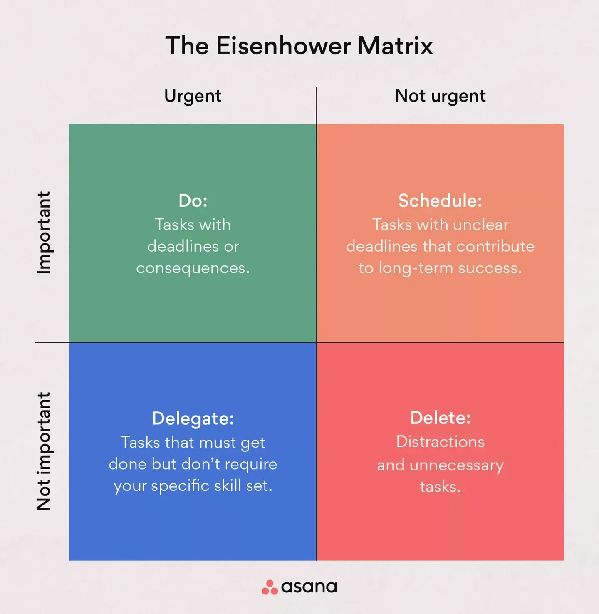

--- 
draft: true
title: "Eisenhower matrix"
date: "2024-12-08T11:19:33+0100"
layout: post
tags: ["productivity", "TODO"]
slug: "eisenhower-matrix"
---

I love the idea of the Eisenhower matrix, where you have your tasks ordered by level of importance and urgency.

I would love to breakdown my todo items in such a way. I am using ToDoist, would they have something for that?

Full video explanation from ToDoist: 